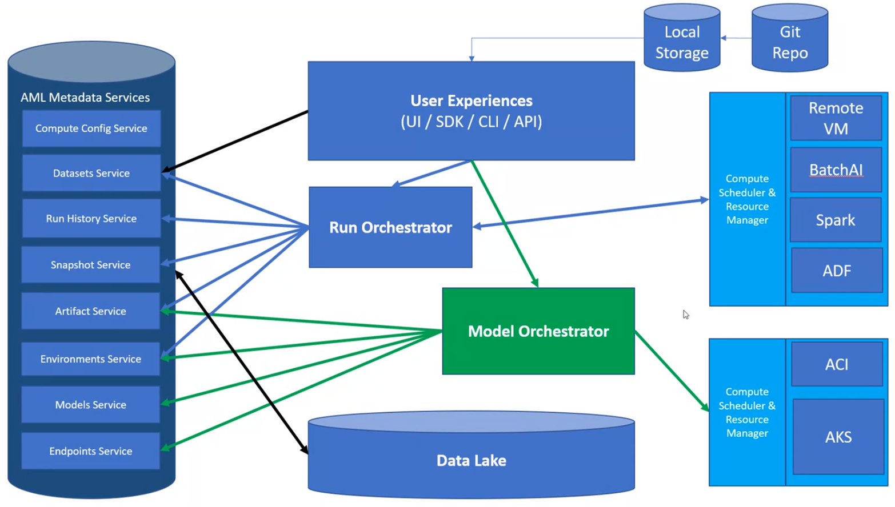
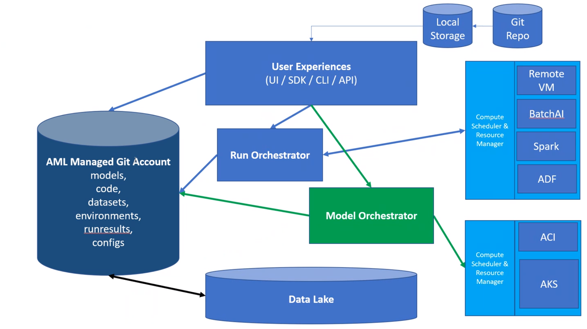
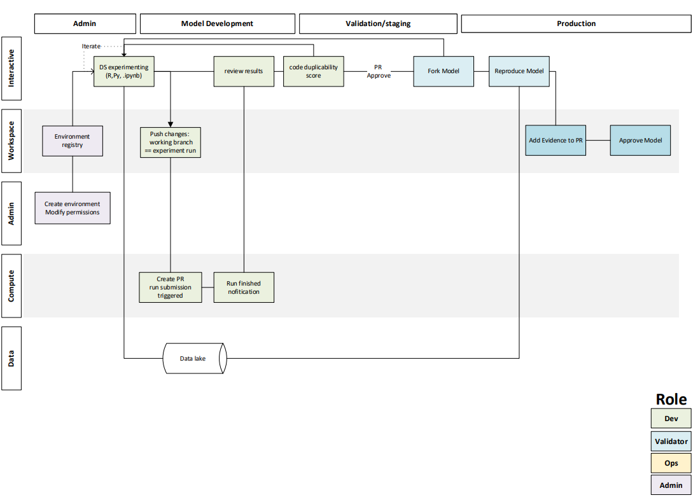
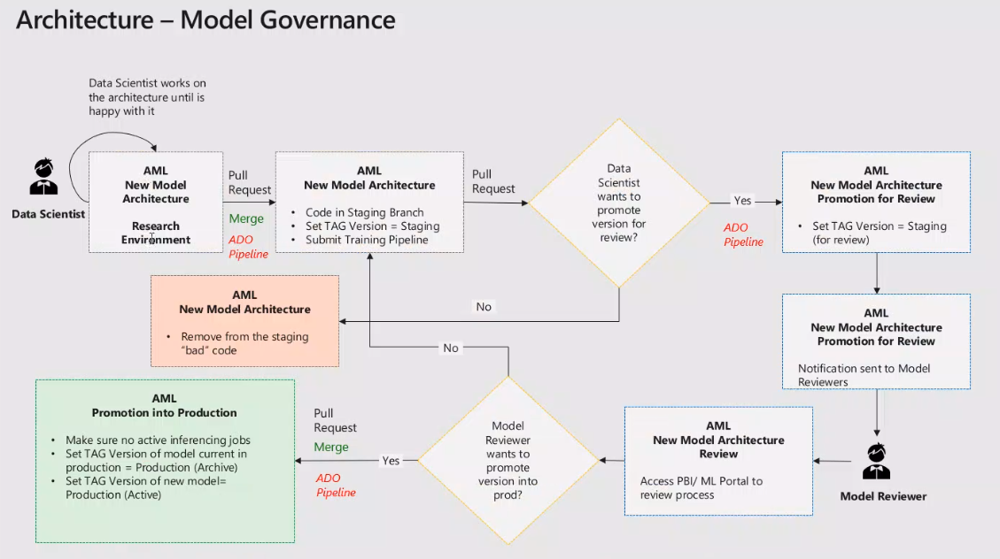
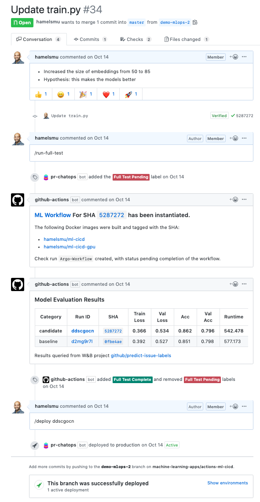
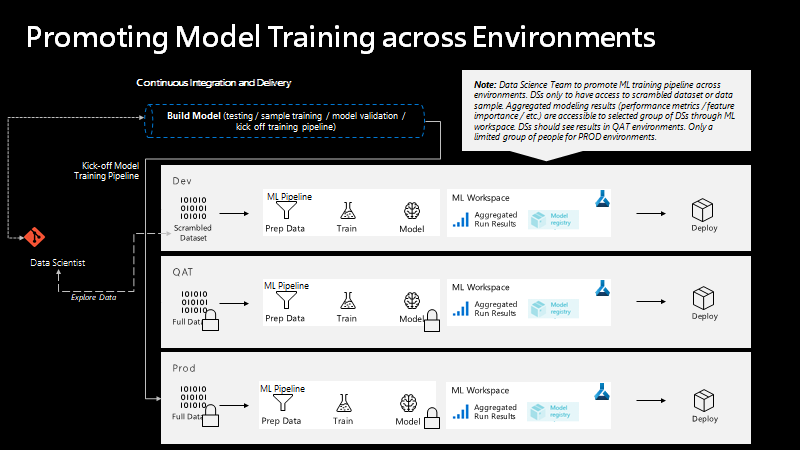

# Git for ML


## Why git?

[87.2% of developers used git in 2018](https://insights.stackoverflow.com/survey/2018#technology)

Reproducibility: entire timeline of changes/decisions/progression of any project

Collaboration: lowers communication barriers, easy to fix mistakes

git feature branching is an [appropriate strategy for data scientist project collaboration](https://www.atlassian.com/git/tutorials/comparing-workflows/feature-branch-workflow)

Benefits:
    - preserve stability of whatever version is in master branch
    - ease development of concurrent feature development
    - can trigger builds/releases, if/when needed


## How git-based ML projects work

Version control machine learning models, data sets and intermediate files in Git.
Leverage GitML to manage references to remote data (large datasets, models) in external data services (Azure Blob, ADLS, S3, NFS, etc.)

Full code and data provenance help track the complete evolution of every ML model. This guarantees reproducibility and makes it easy to switch back and forth between experiments.

### Registering assets in a Git backed project
Convenience commands will register the asset in a repo. Default behavior is assetType/name/version/{contents}
Large file assets will be stored as pointers for gitML to retrieve.

### Deployment and collaboration
Instead of ad-hoc scripts, use push/pull commands to move consistent bundles of ML models, data, and code into production, remote machines, or a colleague's computer.

Each branch represents a state of working (what we today consider to be a workspace).
Collaboration can be established by working in the same repository or referencing other repositories.

The act of promoting a dataset, model, training pipeline, or scoring pipeline to production can be accomplished through the act of authoring / submitting a pull request.

```
gh pr create -s working/newmodel -t staging -r git@github.com/contoso/mlproject
```

## Git for ML - Happy Path
```
gitconfig.json
{'repo': 'https://github.com/Azure/AMLSamples.git', 'branch': 'training-scripts', 'commitSha', 'tag', 'token'}

az ml run submit-script --git-config gitconfig.json --source-directory /training/mnist/exp.yml
```

## Contents

| File/folder       | Description                                |
|-------------------|--------------------------------------------|
| `datasets`             | data definition                      |
| `environments`             | data definition                      |
| `models`             | models                      |
| `experiments`    |  training jobs             |
| `components`     |  shared components 
| `endpoints`     |   endpoint definitions                     |

## Current System


## Proposed Architecture


## Workflow









## Other examples
```
mlflow run git@github.com:mlflow/mlflow-example.git -P alpha=0.5

polyaxon project -p quick-start git --url="https://github.com/polyaxon/polyaxon-quick-start"
polyaxon run

tfjob = TensorFlow(entry_point='train.py',
                       source_dir='char-rnn-tensorflow',
                       git_config=git_config,
                       ...
                       }
```

